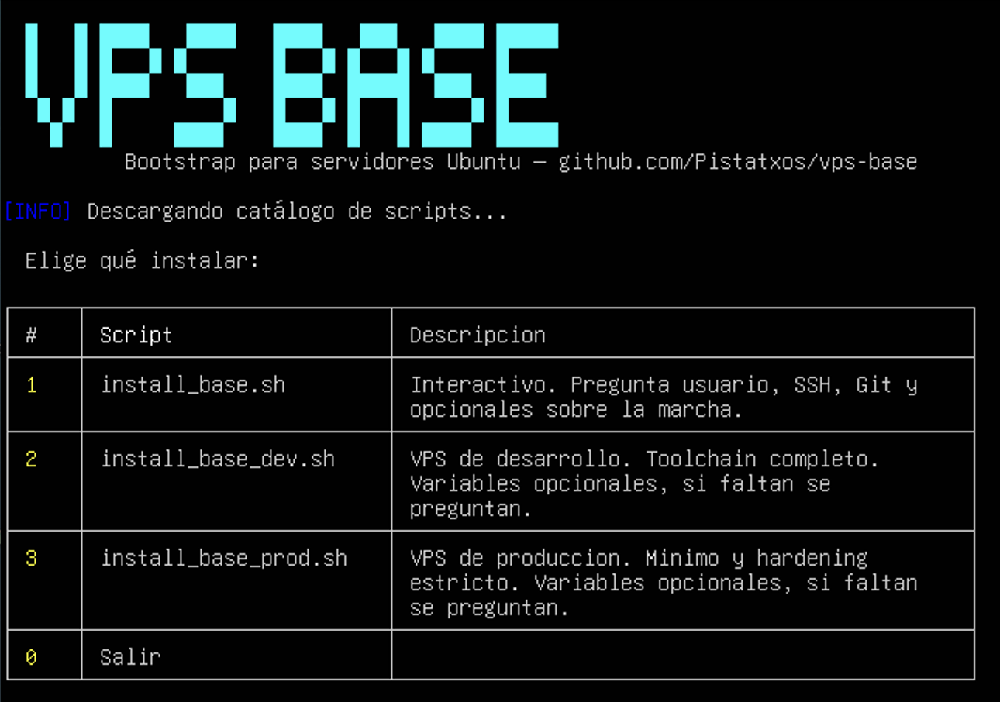

# vps-base

<p align="center">
  
</p>

> Scripts de bootstrap para preparar servidores Ubuntu nuevos de forma rápida, consistente y segura.

---

## Uso rápido — install.sh

La forma más cómoda de arrancar: un único comando en la VPS te muestra un menú y descarga y lanza el script que elijas.

**Opción A — todo en un comando** (más rápido, el clásico `curl | bash`):

```bash
curl -fsSL vps.mariox.es | sudo bash
```

Si el dominio corto no responde, usa la URL larga:

```bash
curl -fsSL https://raw.githubusercontent.com/Pistatxos/vps-base/main/install.sh | sudo bash
```

**Opción B — descargar y luego ejecutar** (más seguro, puedes leer el script antes de lanzarlo):

```bash
curl -fsSL vps.mariox.es -o install.sh
chmod +x install.sh
sudo ./install.sh
```

> Con la opción A, `curl` ya ocupa la entrada estándar, así que tanto `install.sh` como el script que elijas leen sus preguntas de `/dev/tty` en vez de `stdin` — necesitas una terminal interactiva real (una sesión SSH normal vale; falla con un mensaje claro si no hay TTY).

El menú lee la lista de scripts y sus descripciones desde [`scripts.conf`](scripts.conf) — añadir un script nuevo al catálogo es añadir dos líneas ahí (con su ruta dentro de `installers/`), no tocar `install.sh`.

---

## Estructura del repo

```
install.sh              # Punto de entrada — menú interactivo (ver arriba)
scripts.conf            # Catálogo de scripts + descripciones que lee install.sh
installers/
  install_base.sh       # Interactivo — pregunta todo, paso a paso
  install_base_dev.sh   # VPS de desarrollo — variables opcionales + preguntas si faltan
  install_base_prod.sh  # VPS de producción — igual, con hardening/paquetes de PROD
```

---

## `installers/install_base.sh` — interactivo

Pregunta siempre, en este orden: usuario (nuevo o ya existente — si es existente no le toca la contraseña), clave SSH a añadir (opcional), plataforma Git para la Deploy Key, y los opcionales Python (uv) / AWS CLI / Tailscale / ZeroTier — estos últimos con **Enter = Sí** (como siempre ha sido: si no quieres algo, contesta que no explícitamente).

```bash
curl -fsSL https://raw.githubusercontent.com/Pistatxos/vps-base/main/installers/install_base.sh -o install_base.sh
chmod +x install_base.sh
sudo ./install_base.sh
```

---

## `installers/install_base_dev.sh` y `installers/install_base_prod.sh`

Pensados para repetir la misma configuración en varios servidores, pero también sirven sueltos y a mano. Tienen una sección **00** con variables, todas vacías por defecto:

```bash
TARGET_USER=""       # vacío = pregunta (por defecto xuser)
CREATE_USER=""       # "true"/"false" — vacío = pregunta
USER_PASSWORD=""     # solo si CREATE_USER=true
ADD_SSH_KEY=""       # vacío = pregunta (por defecto No)
GIT_HOST="gitlab.com"  # fijo — cámbialo aquí si usas GitHub u otro, nunca se pregunta
INSTALL_AWSCLI=""    # vacío = pregunta (por defecto No)
INSTALL_TAILSCALE="" # vacío = pregunta (por defecto No)
INSTALL_ZEROTIER=""  # vacío = pregunta (por defecto No)
```

La regla: **variable vacía → se pregunta (con Enter = No en estos toggles). Variable rellena → no se pregunta, se usa tal cual.**

- Todo en blanco → el script pregunta esas 5 cosas (usuario nuevo/existente + nombre, clave SSH, AWS CLI, Tailscale, ZeroTier) y nada más.
- Rellena lo que quieras fijo (por ejemplo `CREATE_USER=false` si el usuario ya existe) y esa pregunta desaparece.
- `GIT_HOST` y el toolchain Python **no se preguntan nunca**: `GIT_HOST` es un valor fijo que cambias en el config si no usas GitLab, y Python va implícito — DEV siempre instala `uv`, PROD nunca.

Así ya no hace falta un script aparte para "usuario ya existente": es la misma pregunta la que decide la rama.

```bash
curl -fsSL https://raw.githubusercontent.com/Pistatxos/vps-base/main/installers/install_base_dev.sh -o install_base_dev.sh
chmod +x install_base_dev.sh
sudo ./install_base_dev.sh
```

(mismo patrón para `install_base_prod.sh`)

> ⚠️ Ambos endurecen SSH (`PasswordAuthentication no`, `AllowUsers <usuario>`, `PermitRootLogin no`). Si usas un usuario ya existente, asegúrate de que ya tiene acceso por clave SSH funcionando antes de lanzarlo, o te quedarás fuera.

---

## Qué instala siempre (los 3 scripts de `installers/`)

- Sistema actualizado (`apt update` + `apt upgrade`), con pausa previa de `apt-daily`/`unattended-upgrades` para que no compitan por memoria ni por el lock de dpkg
- Swap automático de 2G si la VPS arranca sin swap
- `unattended-upgrades` — parches de seguridad automáticos, sin reboot
- Herramientas base: git, curl, jq, htop... (el set completo en `install_base.sh`/DEV, mínimo en PROD)
- Docker CE + Compose plugin
- Cockpit (`9090`) — administración visual
- fail2ban — protección SSH (3 intentos / 5 min → ban 1 hora)
- Endurecimiento SSH completo
- Bloqueo del usuario `ubuntu`
- Deploy Key única por servidor (GitLab / GitHub / Gitea)
- Historial bash sin persistencia (completamente desactivado en PROD)
- `README_started.md` — generado en el home del usuario con comandos de referencia: Git, Docker, ufw, fail2ban y, si aplica, uv y ZeroTier

> ⚠️ `ufw` se instala pero **no se activa automáticamente**. Configura las reglas que necesites y actívalo manualmente. Asegúrate de tener el puerto 22 abierto o acceso por VPN antes de ejecutar `ufw enable`.

---

## DEV vs PROD

| Parámetro | `install_base.sh` / DEV | PROD |
|---|:---:|:---:|
| Paquetes de compilación (`build-essential`, `make`, `wget`, `zip`) | ✓ | — |
| Python (uv) | Opcional (interactivo) / siempre (DEV) | Nunca |
| MaxAuthTries | 3 | 2 |
| LoginGraceTime | 30s | 20s |
| ClientAliveCountMax | 2 | 1 |
| Historial bash | 20 líneas | Desactivado (usuario y root) |
| Aviso de `ufw` en README_started.md | — | Sí |

---

## Seguridad

- Ningún dato sensible se guarda en el log (`/var/log/instalacion/`).
- Las Deploy Keys son únicas por servidor.
- `unattended-upgrades` aplica solo parches de seguridad, sin reboot automático.
- Cockpit pensado para acceso solo desde VPN (puerto `9090`).
- `ufw` se instala pero no se activa — configúralo manualmente antes de habilitarlo.
- Los `.env` con secretos deben tener `chmod 600` y nunca entrar en Git.
- **Usa siempre `https://` con el dominio corto o la URL larga, nunca `http://`.** El comando hace `curl | sudo bash` — si el redirect viaja en claro por HTTP, cualquiera en la ruta de red podría interceptarlo y colar un script distinto antes de llegar a GitHub, y eso se ejecutaría como root. `curl -fsSL` (con `-L`) ya sigue redirecciones HTTPS sin problema; si el dominio corto solo responde en HTTP, usa la URL larga de `raw.githubusercontent.com` en su lugar.

---

## Filosofía

Bootstrap reproducible y consistente: uno para "quiero probar algo rápido" (todo interactivo), y dos para "quiero repetir exactamente esto" (DEV/PROD, con la posibilidad de rellenar variables para saltarte las preguntas) — sin mantener media docena de copias casi idénticas para cada combinación de usuario nuevo/existente.
